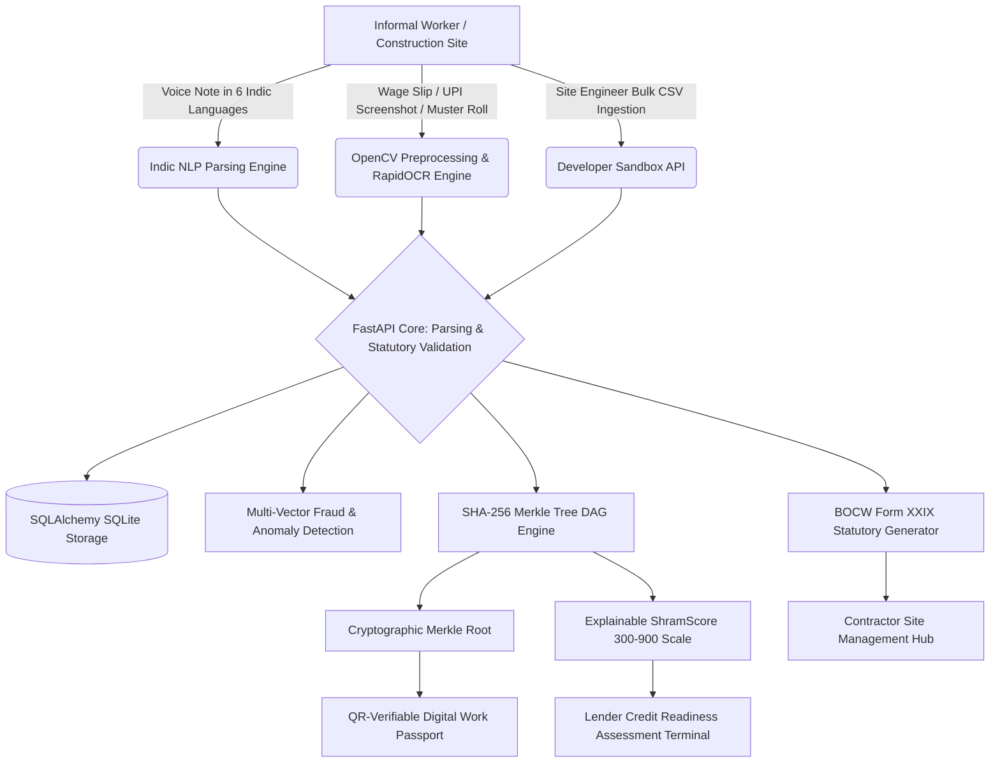

# 🇮🇳 ShramLedger (श्रमLedger)
### **Workforce Credentialing & Alternative Credit Intelligence Platform — Prototype**

[](https://github.com/)
[](https://react.dev/)
[](https://fastapi.tiangolo.com/)
[-orange?logo=opencv&logoColor=white)](https://github.com/RapidAI/RapidOCR)
[](https://en.wikipedia.org/wiki/Merkle_tree)
[](https://labour.gov.in/)
[](backend/tests/)
[](LICENSE)

---

## 📌 Problem & System Overview

India's informal economy employs over **450 million unorganised workers** (construction masons, carpenters, plumbers, electricians, domestic helpers, daily-wage laborers). Because more than 90% of informal wages are disbursed via cash vouchers or unlinked peer-to-peer UPI transfers, workers remain **financially invisible**—lacking formal payslips, tax filings, or traditional credit bureau histories.

Consequently:
- **Informal Workers** are denied institutional micro-credit (such as Mudra Shishu or PM SVANidhi loans) and fall victim to exploitative local moneylenders.
- **Contractors & Construction EPCs** struggle with phantom attendance, duplicate muster rolls, and compliance verification under the **Building and Other Construction Workers (BOCW) Act, 1996**.
- **Banks & NBFCs** lack verifiable, tamper-evident cashflow data required to underwrite collateral-free loans.

**ShramLedger** is a functional developer prototype demonstrating how multi-modal evidence ingestion (voice notes, real document OCR, and site registers), cryptographic Merkle DAG ledgers, multi-vector fraud auditing, and explainable alternative credit scoring (ShramScore™) bridge this gap.



---

## 🔥 Key Technical Demonstrations

### 1. 👁️ Real Computer Vision & OCR Pipeline
Unlike mock OCR tools that return static canned JSON, ShramLedger implements an **actual multi-stage computer vision pipeline** running locally via OpenCV and deep-learning ONNX models:

```
Upload Image (Chit / UPI Slip / Register)
         │
         ▼
[Stage 1: OpenCV Preprocessing]
  • Grayscale conversion
  • Contrast-Limited Adaptive Histogram Equalization (CLAHE)
  • Gaussian blur noise reduction
  • Otsu automatic binary thresholding
         │
         ▼
[Stage 2: RapidOCR ONNX Deep Learning Engine]
  • Text line detection & recognition
  • Word-level bounding boxes & confidence scores
         │
         ▼
[Stage 3: Indic Token & Entity Extraction]
  • Date extraction (ISO / DD-MM-YYYY formats)
  • Daily wage detection (Rs. / INR / ₹ currency patterns)
  • Primary trade classification (Mason, Painter, Electrician, Plumber, etc.)
  • Contractor / site supervisor phone numbers
  • Hours worked and payment mode (Cash, UPI)
         │
         ▼
[Stage 4: Statutory Wage Validation & Merkle Anchoring]
  • Benchmarks wage against regional statutory minimums
  • Computes SHA-256 document fingerprint for anti-tamper tracking
```

### 2. 🔐 Undeniable Ledger Tamper Verification Demo
The platform features an interactive **Merkle DAG Visualizer** that demonstrates tamper detection in real time:

- **Initial State**:
  - `Record 1 (Daily Wage: ₹850)` $\rightarrow$ SHA-256 Leaf Hash $H_1$
  - `Record 2 (Daily Wage: ₹900)` $\rightarrow$ SHA-256 Leaf Hash $H_2$
  - Combined Merkle Root: $\text{SHA-256}(H_1 + H_2)$ $\rightarrow$ `✅ 100% CRYPTOGRAPHICALLY VALID`
- **Simulated Attack**:
  - The user toggles or edits Record 1 from **₹850** to **₹950**.
  - Clicking **"Verify Integrity"** instantly triggers mathematical verification.
  - The engine returns:
    ```
    ❌ TAMPER DETECTED: CRYPTOGRAPHIC INTEGRITY VIOLATION
    Leaf Mismatch: Expected 3c9b71... but computed 7f12a0...
    Root Mismatch: Ledger root broken.
    ```

### 3. 📊 Explainable ShramScore™ (300–900 Scale)
An explainable, multi-factor alternative credit scoring engine designed specifically for informal cashflow patterns:

| Factor | Weight | Evaluation Criteria |
|---|---|---|
| **Income Stability** | 25% | Low day-to-day wage coefficient of variation |
| **Work Continuity** | 20% | Consecutive active work weeks and regularity |
| **Verified Earnings Ratio** | 20% | Proportion of shifts backed by receipts, UPI, or contractor sign-offs |
| **Employer Endorsement** | 15% | Shift records directly authenticated by registered contractors |
| **Evidence Quality** | 10% | Strength of evidence (UPI transaction reference > printed register > self-attested voice) |
| **Skill Demand Tier** | 10% | High-demand trade premiums (e.g. Master Masons, Electricians) |

> **Underwriting Policy & Language**: ShramLedger produces objective credit readiness indicators (e.g., `"Credit Readiness: High — subject to lender policy and human review"`) rather than making unverified loan approval guarantees.

### 4. 🛡️ Multi-vector Fraud & Anomaly Detection Engine
Heuristic multi-vector auditing engine that routes flagged records to human review instead of automated destructive blacklisting:

- **Shift Collision Check**: Flags instances where the same worker logs conflicting shifts with different employers on the same calendar date.
- **Wage Spike Outlier Check**: Flags claims exceeding **4x regional statutory daily benchmarks** (e.g., claiming ₹15,000/day for general masonry).
- **Duplicate Document Fingerprint**: Hashes all uploaded receipts with SHA-256 and alerts when identical vouchers are reused across different workers or dates.

---

## ⚡ 9-Step Guided End-to-End Demo

Click the **"⚡ End-to-End Demo"** button on the top navigation bar to launch the step-by-step interactive demonstration:

1. **Worker Persona Selection**: Select Ramesh Kumar (Skilled Mason, Delhi NCR).
2. **Document Upload**: Select or upload a contractor wage slip image.
3. **OpenCV Preprocessing & RapidOCR**: View grayscale/Otsu threshold visual stage previews and deep-learning extracted tokens.
4. **Indic Entity Extraction**: Automatically parse date, ₹850 wage, contractor name, and hours.
5. **Multi-Vector Fraud Audit**: Screen against shift collisions and wage spike outliers.
6. **Statutory Wage Validation**: Benchmark ₹850 against Delhi's Skilled minimum wage (₹800).
7. **SHA-256 Merkle Ledger Anchoring**: Anchor entry into the immutable Merkle DAG.
8. **Explainable ShramScore**: Recompute credit readiness score (730 / 900).
9. **Digital Work Passport Issuance**: Generate verifiable credential with QR code and cryptographic proof.

---

## ⚙️ Quickstart & Local Deployment

### Prerequisites
- **Node.js**: v18.0 or higher
- **Python**: v3.10 or higher (Python 3.11+ recommended)

### 1. Backend Setup (FastAPI + RapidOCR + OpenCV)
```bash
cd backend
# Create & activate virtual environment
python -m venv .venv
.\.venv\Scripts\Activate.ps1   # On Windows
# source .venv/bin/activate    # On Linux/macOS

# Install dependencies (FastAPI, OpenCV headless, RapidOCR ONNX, SQLAlchemy, Pytest)
pip install -r requirements.txt

# Start FastAPI backend server
python -m uvicorn app.main:app --port 8000 --host 127.0.0.1 --reload
```
- API Base URL: `http://127.0.0.1:8000`
- Interactive OpenAPI Docs: `http://127.0.0.1:8000/docs`

### 2. Frontend Setup (React 19 + Vite)
```bash
cd frontend
# Install dependencies
npm install

# Start Vite dev server
npm run dev
```
- Frontend UI: `http://localhost:5173/`

---

## 🧪 Automated Test Suite

Run the full pytest suite in the backend virtual environment:

```bash
cd backend
.\.venv\Scripts\python -m pytest -v
```

### Verified Terminal Test Results:
```text
============================= test session starts =============================
platform win32 -- Python 3.14.4, pytest-9.1.1, pluggy-1.6.0
rootdir: c:\Users\...\shramledger\backend
collected 24 items

tests/test_core.py::test_root_endpoint PASSED                            [  4%]
tests/test_core.py::test_otp_and_dpdp_onboarding PASSED                  [  8%]
tests/test_core.py::test_speech_nlp_indic_extraction PASSED              [ 12%]
tests/test_core.py::test_ocr_multi_evidence_extraction PASSED            [ 16%]
tests/test_core.py::test_evidence_strength_engine PASSED                 [ 20%]
tests/test_core.py::test_tamper_evident_merkle_dag PASSED                [ 25%]
tests/test_core.py::test_explainable_shramscore PASSED                   [ 29%]
tests/test_core.py::test_employer_action_endpoint PASSED                 [ 33%]
tests/test_core.py::test_lender_underwriting_api PASSED                  [ 37%]
tests/test_core.py::test_fraud_shift_collision_detection PASSED          [ 41%]
tests/test_core.py::test_audit_logging PASSED                            [ 45%]
tests/test_core.py::test_enterprise_quote_generation PASSED              [ 50%]
tests/test_core.py::test_bulk_muster_roll_ingestion PASSED               [ 54%]
tests/test_core.py::test_api_key_lifecycle PASSED                        [ 58%]
tests/test_core.py::test_lender_custom_risk_policy_evaluation PASSED     [ 62%]
tests/test_core.py::test_payout_batch_execution PASSED                   [ 66%]
tests/test_core.py::test_bocw_statutory_report PASSED                    [ 70%]
tests/test_core.py::test_contact_sales_lead_capture PASSED               [ 75%]
tests/test_core.py::test_real_ocr_pipeline_from_image_bytes PASSED       [ 79%]
tests/test_core.py::test_tamper_detection_wage_change_850_to_950 PASSED  [ 83%]
tests/test_core.py::test_ledger_verify_tamper_api_endpoint PASSED        [ 87%]
tests/test_core.py::test_shramscore_credit_readiness_language PASSED     [ 91%]
tests/test_core.py::test_multivector_fraud_detection_engine PASSED       [ 95%]
tests/test_core.py::test_end_to_end_credentialing_pipeline PASSED        [100%]

======================= 24 passed, 1 warning in 10.37s ========================
```

---

## 🔌 Developer Sandbox API Reference

All sandbox endpoints authenticate via the `x-api-key` header (`shram_sand_demo_sandbox_01`).

```http
# 1. Real OCR Document Ingestion (Multipart Image File)
POST /api/ingest/ocr-upload
Content-Type: multipart/form-data

file: [Binary Image: chit.jpg / upi_slip.png]

# Response:
{
  "extracted_text": "Shree Ram Construction Daily Wage Rs. 850 ...",
  "bounding_boxes": [{"box": [10, 15, 140, 35], "text": "Daily Wage", "confidence": 0.94}],
  "parsed_entities": {
    "date": "2026-09-11",
    "amount": 850.0,
    "skill_type": "Mason / राजमिस्त्री",
    "employer_name": "Shree Ram Construction",
    "hours_worked": 8.0
  },
  "document_hash": "a591a6d40bf420404a011733cfb7b190d62c65bf0bcda32b57b277d9ad9f146e",
  "preprocessing_previews": {
    "grayscale": "data:image/jpeg;base64,...",
    "otsu_binary": "data:image/jpeg;base64,..."
  }
}

# 2. Merkle DAG Tamper Verification
POST /api/ledger/verify-tamper
Content-Type: application/json

{
  "worker_id": "worker_ramesh",
  "tampered_entry_id": "WRK-RAM-01",
  "tampered_wage": 950.0
}

# 3. Credit Underwriting Income Summary (Consent Governed)
GET /api/v1/workers/worker_ramesh/income-summary
Headers:
  x-api-key: shram_sand_demo_sandbox_01
  x-dpdp-purpose: LOAN_UNDERWRITING_MUDRA
```

---

## 👤 Author & Architecture Notes

- **System Architect & Lead Developer**: **Kulbhushan**
- **Project Status**: Functional Prototype & Developer Sandbox
- **License**: MIT Open Source License
