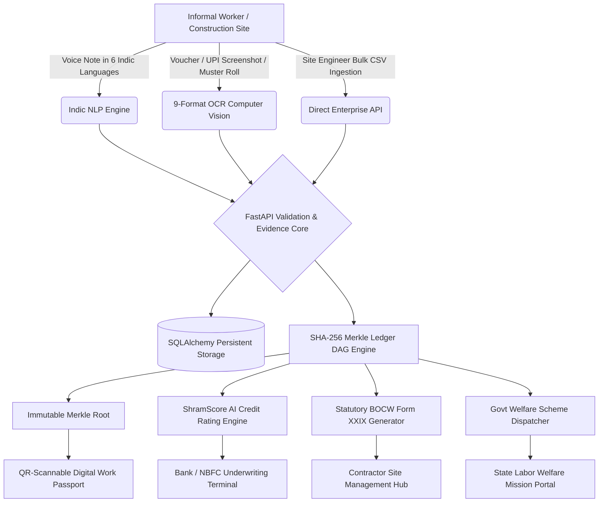

# 🇮🇳 ShramLedger Enterprise (श्रमLedger)
### **Official B2B SaaS & GovTech Platform for Informal Workforce Credentialing, Alternative Credit Underwriting & Statutory BOCW Compliance**

[](https://github.com/)
[](https://react.dev/)
[](https://fastapi.tiangolo.com/)
[](https://en.wikipedia.org/wiki/Merkle_tree)
[](https://labour.gov.in/)
[](LICENSE)
[](https://github.com/)

---

## 📌 Executive Summary & Commercial Pitch

India's informal economy comprises **450 million+ unorganised workers** (construction masons, carpenters, plumbers, electricians, domestic workers, street vendors) generating over **₹47,000 Crore annually** in daily wages. However, because 90%+ of these wages are disbursed in cash or unlinked UPI transactions, workers remain **financially invisible** without formal payslips or CIBIL credit histories.

At the same time, **Construction EPCs and Infrastructure Contractors** face recurring payroll leakages, ghost labor inflation, and crippling statutory fines under the **Building and Other Construction Workers (BOCW) Act, 1996**. **Banks and NBFCs** lack verifiable income proof to underwrite collateral-free micro-loans (Mudra, PM SVANidhi).

**ShramLedger Enterprise** solves this multi-billion dollar problem with an institutional, cryptographically secured workforce credentialing and underwriting platform.



---

## 🌟 Enterprise Modules & Core Capabilities

### 1. 🏗️ Contractor & EPC Site Management Hub
- **Bulk Muster Roll Ingestion**: Upload site shift registers via CSV/Excel or API. Automatically validates trade wages against state minimum wage baselines and anchors shift entries into **SHA-256 Merkle blocks** in under 500ms.
- **Statutory BOCW Act Form XXIX Inspection Report**: 1-click generation of statutory wage registers, mandays calculation, and 1% BOCW Cess compliance certificates for state labor inspectorates.
- **Batch Wage Payouts**: Generates bank-ready NACH/UPI batch files with tamper-proof cryptographic transaction signatures.
- **Ghost Labor Elimination**: Detects duplicate identity claims and conflicting shift logs across sub-contractors.

### 2. 💳 Bank & NBFC Credit Underwriting Gateway
- **ShramScore™ Alternative Credit Rating (300–900)**: Evaluates 6 transparent dimensions:
  1. *Income Stability Score (25%)*
  2. *Work Continuity Score (20%)*
  3. *Verified Earnings Score (20%)*
  4. *Employer Endorsement Ratio (15%)*
  5. *Evidence Quality Band (10%)*
  6. *Skill Demand Tier (10%)*
- **Custom Risk Policy Engine**: Lenders can define institutional thresholds (Min ShramScore, Max Volatility %, Min Work Days) to execute automated credit decisioning.
- **Instant Loan Sanction Letter Generator**: Issues formal approval letters for Mudra Shishu/Kishor (₹50k-₹2L) with automated amortization schedules.
- **B2B REST API & Key Management**: Provision live production (`shram_live_...`) and sandbox keys with configurable rate limits (up to 600 RPM).

### 3. 🏛️ State Labor Mission & Welfare Dispatch Hub
- **District-level Wage & Labor Heatmap**: Visualizes real-time wage disparities and welfare coverage gaps across states and trades.
- **Direct Automated Scheme Dispatch**: Pre-qualifies and dispatches worker packets to **PM Vishwakarma**, **e-Shram**, **PM SVANidhi**, **BOCW Welfare Fund**, and **PMMY Mudra**.
- **Anti-Collusion & Fraud Radar**: Real-time monitoring for duplicate shift collisions and rapid endorsement anomalies.

### 4. 📜 Verifiable Digital Work Passport for Workers
- **Multilingual Voice-First Logging**: Natural speech ingestion in Hindi, Hinglish, Marathi, Tamil, Bengali, and English.
- **9-Format Document OCR**: Computer vision extraction for handwritten contractor chits, printed muster rolls, and UPI screenshots.
- **Bank-Grade Digital Certificate**: QR-code enabled, high-resolution A4 PDF with holographic security badge, DPDP consent proof hash, and SHA-256 Merkle Root.
- **Interactive Merkle Tamper Simulator**: Transparent cryptographic verification proving that altering even ₹1 in history causes an immediate verification failure.

---

## 💼 Commercial SaaS Pricing Plans

| Tier | Target Client | Pricing | Core Inclusions |
|---|---|---|---|
| **Contractor Pro** | Construction EPCs & Builders | **₹1,999 / site / mo** + ₹4 / worker | Unlimited Voice/OCR logs, Bulk Muster Roll Ingestion, BOCW Form XXIX Statutory Reports, Contractor Digital Stamp. |
| **FinTech & NBFC API** | Banks, NBFCs & Digital Lenders | **₹4,999 / mo** + ₹3.50 / query | Real-time Underwriting REST API, DPDP Consent Gated Queries, Custom Risk Policy Engine, Loan Sanction Simulator. |
| **Sovereign GovTech** | State Labor Boards & Missions | **Custom Enterprise SLA** | State-Wide Labor Census, Direct DBT Scheme Dispatch, Sovereign Cloud/On-Premise Deployment, Dedicated Solutions Lead. |

---

## 🏛️ Statutory Compliance & Security Standards

- **Digital Personal Data Protection (DPDP) Act, 2023**: Purpose-specific consent artifacts (`CONSENT-DPDP-2026-XXXX`) with cryptographic verification hashes and 1-click revocation endpoints.
- **Building and Other Construction Workers (BOCW) Act, 1996**: Automated calculation of 1% statutory cess and generation of Form XXIX wage registers.
- **Aadhaar Masking Protocol**: Strict masking of sensitive PII (`XXXX-XXXX-1904`) ensuring zero unencrypted Aadhaar storage.
- **Cryptographic Immutability**: Standard SHA-256 Merkle Tree DAG guarantees mathematical data integrity across all worker records.

---

## 🔌 Enterprise REST API Reference

All institutional B2B endpoints require the `x-api-key` header for authentication.

### Key API Endpoints

```http
# 1. Generate Formal Enterprise Proposal & Quote
POST /api/enterprise/quote
Content-Type: application/json

{
  "company_name": "Larsen & Toubro Infra Ltd",
  "contact_name": "Anil Verma",
  "email": "anil.verma@lntepc.com",
  "phone": "+91 98111 22334",
  "organization_type": "Construction EPC",
  "active_sites_count": 5,
  "estimated_workers": 1200,
  "plan_tier": "contractor_pro",
  "billing_cycle": "annual"
}

# 2. Ingest Bulk Site Muster Roll & Anchor to Ledger
POST /api/enterprise/bulk-muster
Content-Type: application/json

{
  "employer_id": "emp_lnt_01",
  "employer_name": "L&T Infrastructure",
  "site_name": "Noida Metro Extension Site 04",
  "records": [
    {
      "worker_name": "Ramesh Kumar",
      "phone": "+91 98765 43210",
      "primary_trade": "Mason / राजमिस्त्री",
      "hours_worked": 8.0,
      "daily_wage": 850.0,
      "payment_mode": "Cash",
      "site_location": "Noida Sector 62",
      "work_date": "2026-09-11"
    }
  ],
  "auto_anchor_ledger": true
}

# 3. Evaluate Borrower against Custom Underwriting Policy
POST /api/enterprise/lender-policy/evaluate
Content-Type: application/json

{
  "worker_id": "worker_ramesh",
  "requested_loan_amount": 50000.0,
  "loan_tenure_months": 12,
  "policy": {
    "min_shram_score": 650,
    "max_income_volatility_pct": 40.0,
    "min_work_days_logged": 30,
    "min_verified_ratio_pct": 50.0,
    "max_loan_limit": 150000.0
  }
}

# 4. Query Consent-Governed Income Summary (Underwriting API)
GET /api/v1/workers/{worker_id}/income-summary
Headers:
  x-api-key: shram_live_hdfc_8a92f4c1e0
  x-dpdp-purpose: LOAN_UNDERWRITING_MUDRA

# 5. Generate BOCW Act Form XXIX Statutory Report
GET /api/enterprise/bocw-report?site_id=site_delhi_metro_04
```

---

## ⚙️ Quickstart & Local Deployment

### Prerequisites
- **Node.js**: v18.0 or higher
- **Python**: v3.10 or higher (Python 3.11+ recommended)

### 1. Backend Setup (FastAPI)
```bash
cd backend
# Create & activate virtual environment
python -m venv .venv
.\.venv\Scripts\Activate.ps1   # On Windows
# source .venv/bin/activate    # On Linux/macOS

# Install production dependencies
pip install -r requirements.txt

# Run FastAPI backend server
python -m uvicorn app.main:app --port 8000 --host 127.0.0.1 --reload
```
*API Base URL:* `http://127.0.0.1:8000`  
*Swagger Documentation:* `http://127.0.0.1:8000/docs`

### 2. Frontend Setup (React 19 + Vite)
```bash
cd frontend
# Install dependencies
npm install

# Run Vite dev server
npm run dev
```
*Frontend URL:* `http://localhost:5173/`

### 3. Running the Automated Test Suite
```bash
cd backend
.\.venv\Scripts\python -m pytest -v
```
All **18 automated test suites** verify:
- Speech NLP entity extraction
- OCR document parsing & bounding boxes
- Merkle Tree DAG immutability & tamper detection
- Explainable ShramScore algorithm
- Bulk muster roll batch anchoring
- Lender underwriting policy evaluator
- Statutory BOCW report generation
- API key generation and audit logging

---

## 👤 Author & Enterprise Contact

- **System Architect & Lead Developer**: **Kulbhushan**
- **Commercial Licensing & Partnerships**: `sales@shramledger.in`
- **Version**: 1.0.0 (Production Release)
- **License**: Commercial SaaS License with open-source reference implementation (MIT)
