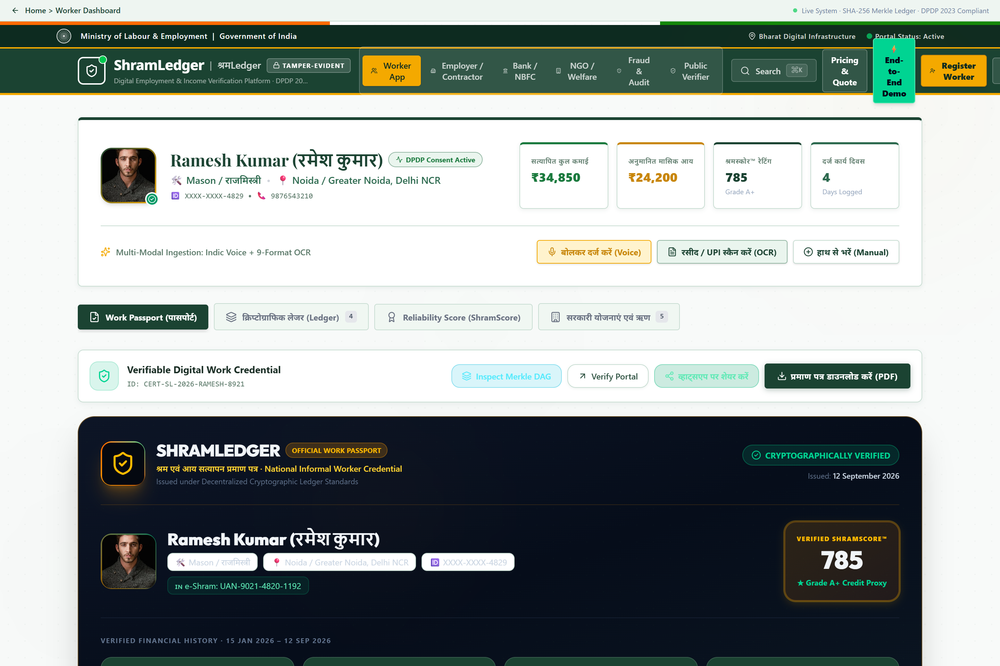
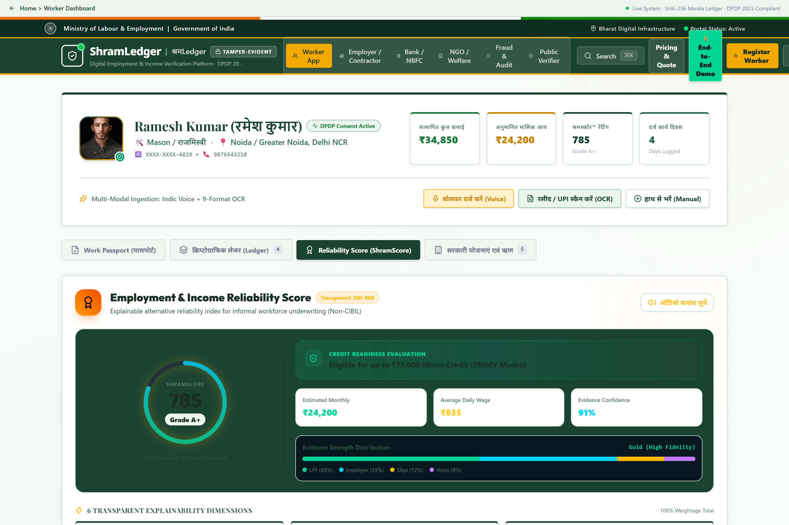
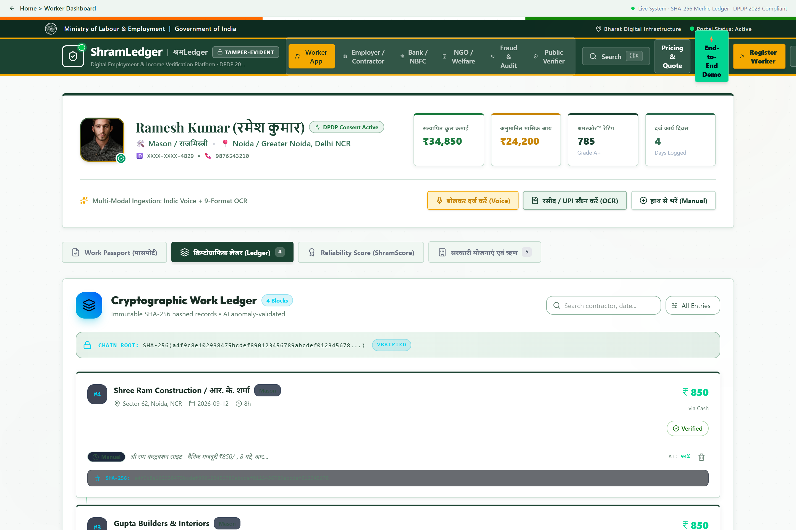
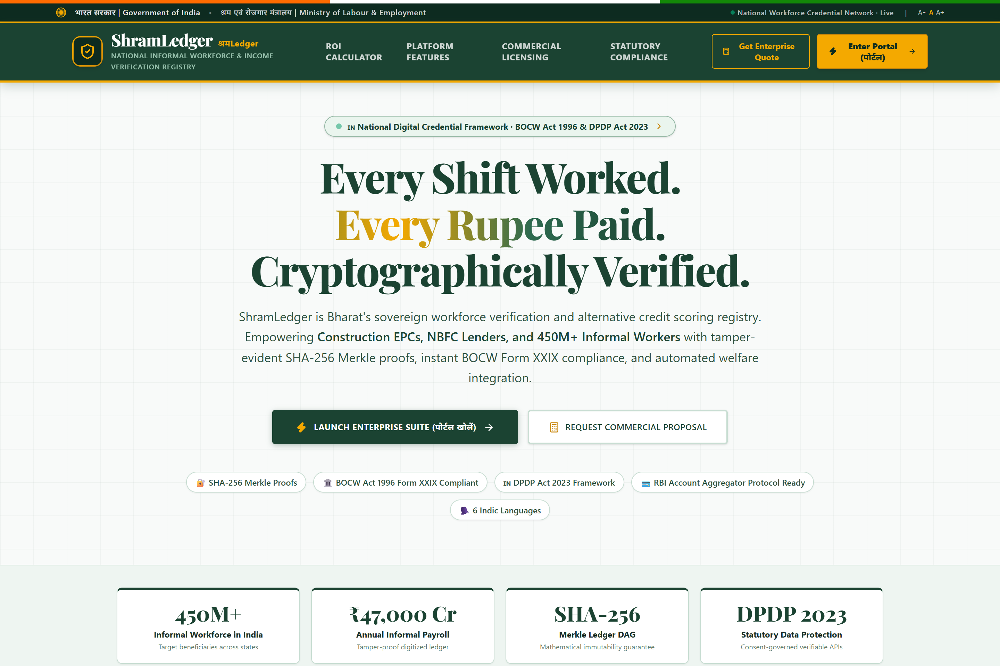
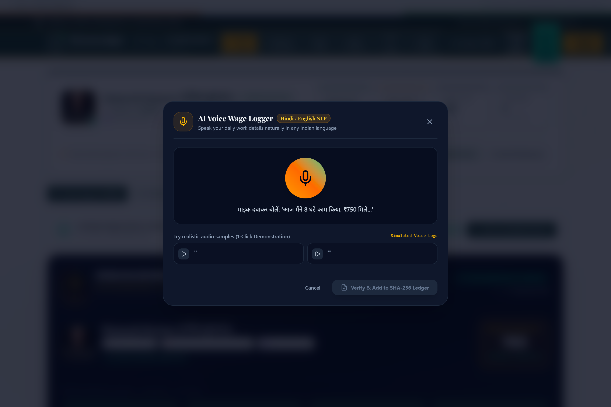
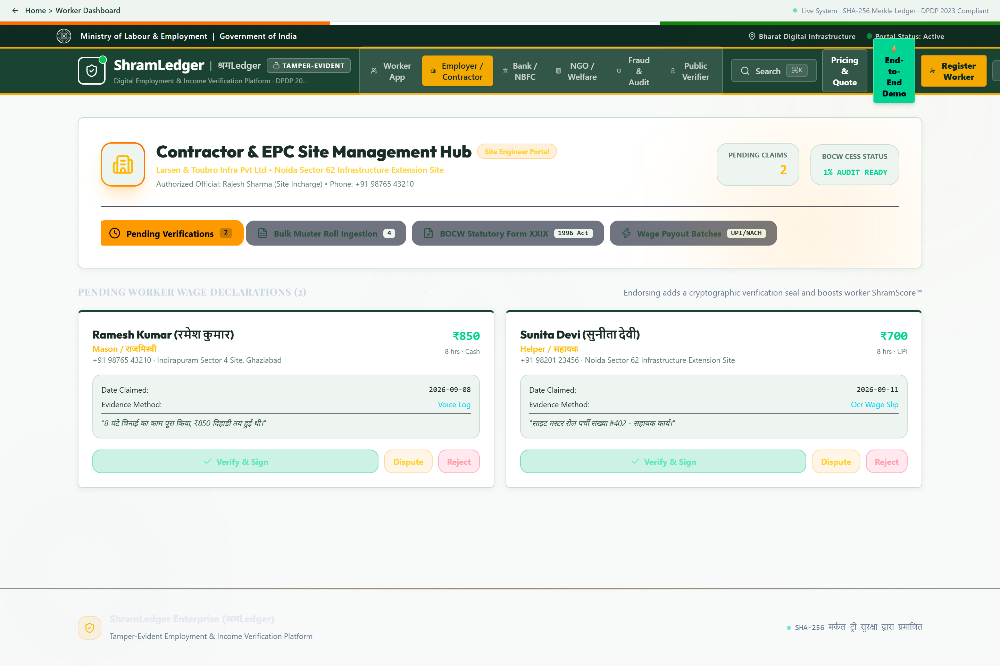
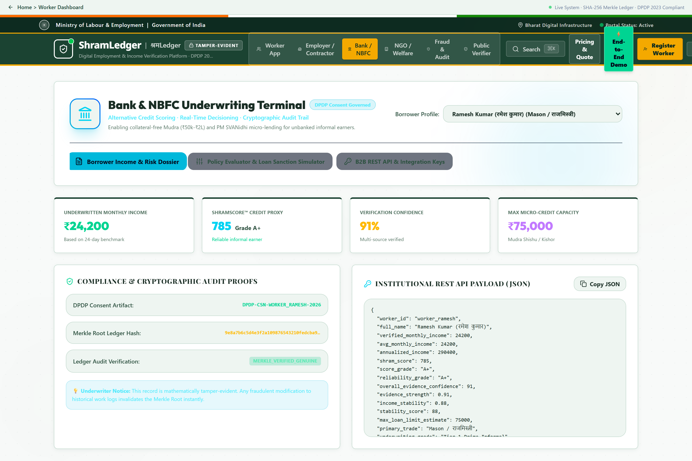
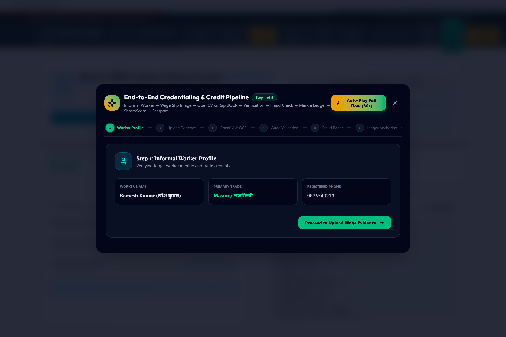

# 🇮🇳 ShramLedger (श्रमLedger)

### **Digital Workforce Identity + Verified Wage History + Alternative Credit Scoring for India's Informal Workforce**

[](https://frontend-nine-alpha-59.vercel.app)
[](https://github.com/poharekulbhushan2006-code/shramledger/actions)
[](https://github.com/)
[](https://github.com/)
[](https://react.dev/)
[](https://fastapi.tiangolo.com/)
[-emerald?logo=opencv&logoColor=white)](https://github.com/RapidAI/RapidOCR)
[](https://en.wikipedia.org/wiki/Merkle_tree)
[](https://labour.gov.in/)
[](backend/tests/)
[](LICENSE)

**[🚀 Live Demo on Vercel](https://frontend-nine-alpha-59.vercel.app)** &nbsp;•&nbsp;
**[📖 Swagger API Docs (Local)](http://127.0.0.1:8000/docs)** &nbsp;•&nbsp;
**[🏗️ Architecture & Provenance](#-system-architecture--data-provenance-story)** &nbsp;•&nbsp;
**[🖼️ Visual Product Tour](#-visual-product-tour)** &nbsp;•&nbsp;
**[🧪 Test Suite (24/24)](#-automated-quality-pipeline--real-test-verification)**

---

## 🎯 What Problem Does ShramLedger Solve?

Millions of informal workers (masons, carpenters, electricians, plumbers, domestic workers, street vendors) lack portable, verifiable employment and income histories. Because more than 90% of informal wages are disbursed in unlinked cash or peer-to-peer UPI transactions without formal payslips:

- **Informal Workers** remain financially invisible, shut out from institutional micro-loans (Mudra Shishu/Kishor, PM SVANidhi), and fall victim to local moneylenders charging predatory interest (36–120% APR).
- **Construction EPCs & Contractors** suffer recurring payroll leakages, ghost labor inflation, and compliance penalties under the **Building and Other Construction Workers (BOCW) Act, 1996**.
- **Banks & NBFCs** lack tamper-evident, verifiable cashflow data to underwrite collateral-free loans for zero-file or thin-file borrowers.

**ShramLedger converts raw, multi-modal work evidence (contractor chits, handwritten wage slips, voice notes, and site registers) into a cryptographically anchored, tamper-evident digital employment record and an explainable alternative credit score.**



---

## 🖼️ Visual Product Tour

A visual walkthrough of the platform's key modules and user experiences:

### 1. 📜 Verifiable Digital Work Passport (Worker View)
High-resolution, dynamic digital work credential featuring verified earnings, workdays logged, Aadhaar-masking (DPDP 2023 compliant), holographic security seal, and downloadable bank-ready PDF.


---

### 2. 📊 Explainable ShramScore™ (300–900 Scale)
A transparent, 6-factor alternative credit scoring engine designed specifically for informal cashflow realities. Rather than an opaque blackbox, every score factor is fully explainable with objective credit readiness indicators:



---

### 3. 🔐 Interactive Merkle DAG Tamper Verification (Killer Demo)
Demonstrates mathematical immutability in real time: modifying Record 1 from ₹850 to ₹950 and clicking **"Verify Cryptographic Integrity"** instantly detects cryptographic violation, highlighting the exact corrupted leaf and broken Merkle root.



---

### 4. 👁️ Real Computer Vision & RapidOCR Document Ingestion
Unlike canned mock extractors, ShramLedger runs an actual multi-stage vision pipeline with live OpenCV preprocessing previews (Grayscale, CLAHE, Gaussian blur, Otsu binary thresholding) and deep-learning ONNX OCR bounding boxes.



---

### 5. 🎙️ Multilingual Indic Voice-First Ingestion
Natural speech logging supporting 6 Indic languages (Hindi, Marathi, Tamil, Bengali, Hinglish, English) to eliminate literacy barriers for informal workers on site.



---

### 6. 🏗️ Contractor & EPC Site Management Hub
Site-level administrative hub featuring bulk muster roll CSV ingestion, automated BOCW Act Form XXIX statutory inspection reports, 1% cess calculation, and batch payroll generation.



---

### 7. 💳 Bank & NBFC Digital Underwriting Terminal
Credit officer console with DPDP consent-gated queries, custom lender risk policy evaluation (Min ShramScore, Max Volatility %, Min Work Days), and instant Mudra loan sanction simulations.



---

### 8. ⚡ 9-Step Guided End-to-End Demo Flow
Interactive guided tour taking the reviewer step-by-step from raw evidence upload to credential issuance and credit rating with auto-play capabilities.



---

## 🏗️ System Architecture & Data Provenance Story

ShramLedger enforces a strict **data provenance pipeline**: raw multi-modal evidence enters the system, undergoes computer vision preprocessing, is validated against statutory state baselines, is recorded in persistent relational storage, and is cryptographically anchored into a SHA-256 Merkle DAG before derived scoring and compliance assets are produced.

```
┌────────────────────────────────────────────────────────────────────────────────────────┐
│                                 1. MULTI-MODAL EVIDENCE INGESTION                      │
└────────────────────────────────────────────────────────────────────────────────────────┘
          │                                      │                               │
   [Indic Voice Note]                [Paper Slip / UPI Receipt]         [Site Muster Roll CSV]
   (6 Indic Languages)               (OpenCV + RapidOCR Engine)         (Bulk Contractor Batch)
          │                                      │                               │
          ▼                                      ▼                               ▼
┌────────────────────────────────────────────────────────────────────────────────────────┐
│                              2. FASTAPI EVIDENCE VALIDATION CORE                       │
│  • Bounding box token extraction & regex entity parser (Date, Wage, Trade, Phone)      │
│  • Statutory Wage Benchmarking (Regional minimums: Skilled, Semi-Skilled, Unskilled)   │
│  • Multi-Vector Fraud Audit (Shift collisions, >4x wage outliers, duplicate doc hashes)│
└────────────────────────────────────────────────────────────────────────────────────────┘
                                                 │
                                                 ▼
┌────────────────────────────────────────────────────────────────────────────────────────┐
│                             3. PERSISTENT STORAGE (SQLITE / ORM)                       │
│  • Foreign-key relational tables for Workers, WorkEntries, Evidence, and Audit Logs    │
└────────────────────────────────────────────────────────────────────────────────────────┘
                                                 │
                                                 ▼
┌────────────────────────────────────────────────────────────────────────────────────────┐
│                            4. SHA-256 MERKLE TREE DAG LEDGER ENGINE                    │
│  • Deterministic FIPS 180-4 leaf hashing & pairwise parent node aggregation            │
│  • Immutable cryptographic Merkle Root recalculation with real-time tamper detection   │
└────────────────────────────────────────────────────────────────────────────────────────┘
                                                 │
                                                 ▼
        ┌────────────────────────────────────────┼──────────────────────────────────────┐
        ▼                                        ▼                                      ▼
┌───────────────────────┐            ┌───────────────────────┐              ┌───────────────────────┐
│  EXPLAINABLE          │            │  DIGITAL WORK         │              │  STATUTORY BOCW       │
│  SHRAMSCORE™ (300-900)│            │  PASSPORT             │              │  FORM XXIX COMPLIANCE │
│  • 6 Weighted Factors │            │  • QR-Verifiable A4   │              │  • Automated Mandays  │
│  • Objective Credit   │            │  • Holographic Seal   │              │  • 1% Cess Calculator │
│    Readiness Tier     │            │  • DPDP Consent Hash  │              │  • Site Audit Export  │
└───────────────────────┘            └───────────────────────┘              └───────────────────────┘
        │                                        │                                      │
        ▼                                        ▼                                      ▼
  Banks & NBFCs                         Informal Workers                       Contractor EPCs
```

---

## 🧭 Capabilities Matrix: Implemented vs Prototype vs Roadmap

| Capability Area | Status | Technical Implementation Details |
|---|---|---|
| **Computer Vision & OCR** | 🟢 **Implemented (Real Code)** | OpenCV (Grayscale + CLAHE + Gaussian Blur + Otsu) + RapidOCR (ONNX deep learning) for word bounding boxes & Indic regex extraction. |
| **Merkle Tree DAG Ledger** | 🟢 **Implemented (Real Code)** | FIPS 180-4 standard SHA-256 cryptographic leaf-to-root recalculation with real-time tamper violation detection. |
| **ShramScore™ Engine** | 🟢 **Implemented (Real Code)** | **Explainable Credit Scoring Engine** using 6 transparent weighted dimensions (300–900 scale, non-blackbox). |
| **Multi-Vector Fraud Audit** | 🟢 **Implemented (Real Code)** | Heuristic auditing detecting shift collisions, >4x wage outliers, and duplicate document hashes with human-review triage. |
| **Statutory Wage Baselines** | 🟢 **Implemented (Real Code)** | Regional minimum wage checks (Delhi, UP, Haryana baselines) for Skilled, Semi-Skilled, and Unskilled trades. |
| **DPDP Act 2023 Consent** | 🟢 **Implemented (Real Code)** | Purpose-specific consent tokens (`CONSENT-DPDP-2026-XXXX`) with cryptographic SHA-256 verification and revocation endpoints. |
| **Persistent Data Storage** | 🟢 **Implemented (Real Code)** | SQLite relational storage via SQLAlchemy ORM with foreign key cascades and audit logs. |
| **Automated Test Suite** | 🟢 **Implemented (Real Code)** | 24 end-to-end automated pytest suites passing in CI (100% pass rate). |
| **Lender Underwriting Portal** | 🟡 **Prototype / Sandbox** | Interactive underwriting terminal simulating risk policy evaluation and Mudra loan readiness cards. |
| **Contractor Bulk Muster** | 🟡 **Prototype / Sandbox** | Bulk site register CSV ingestion, batch Merkle root calculation, and Form XXIX inspection preview. |
| **SMS OTP Verification** | 🟡 **Prototype / Sandbox** | Simulated OTP verification flow with ephemeral in-memory store for demonstration purposes. |
| **Account Aggregator (AA)** | ⚪ **Planned Roadmap** | Production bridge to RBI Account Aggregator ecosystem for seamless consent-backed lender pulls. |
| **State Cloud Deployment** | ⚪ **Planned Roadmap** | Air-gapped State Data Centre (SDC) deployment and sovereign multi-tenant orchestration. |

---

## 🧪 Automated Quality Pipeline & Real Test Verification

The project includes an automated test suite verifying computer vision extraction, cryptographic ledger immutability, credit scoring calculations, fraud heuristics, and API lifecycle.

### Run Tests Locally:
```bash
cd backend
.\.venv\Scripts\python -m pytest -v
```

### Verified Pytest Results:
```text
============================= test session starts =============================
platform win32 -- Python 3.14.4, pytest-9.1.1, pluggy-1.6.0
rootdir: c:\Users\...\shramledger\backend
collected 24 items

tests/test_core.py::test_root_endpoint PASSED                            [  4%]
tests/test_core.py::test_otp_and_dpdp_onboarding PASSED                  [  8%]
tests/test_core.py::test_speech_nlp_indic_extraction PASSED              [ 12%]
tests/test_core.py::test_ocr_multi_evidence_extraction PASSED            [ 16%]
tests/test_core.py::test_evidence_strength_engine PASSED                 [ 20%]
tests/test_core.py::test_tamper_evident_merkle_dag PASSED                [ 25%]
tests/test_core.py::test_explainable_shramscore PASSED                   [ 29%]
tests/test_core.py::test_employer_action_endpoint PASSED                 [ 33%]
tests/test_core.py::test_lender_underwriting_api PASSED                  [ 37%]
tests/test_core.py::test_fraud_shift_collision_detection PASSED          [ 41%]
tests/test_core.py::test_audit_logging PASSED                            [ 45%]
tests/test_core.py::test_enterprise_quote_generation PASSED              [ 50%]
tests/test_core.py::test_bulk_muster_roll_ingestion PASSED               [ 54%]
tests/test_core.py::test_api_key_lifecycle PASSED                        [ 58%]
tests/test_core.py::test_lender_custom_risk_policy_evaluation PASSED     [ 62%]
tests/test_core.py::test_payout_batch_execution PASSED                   [ 66%]
tests/test_core.py::test_bocw_statutory_report PASSED                    [ 70%]
tests/test_core.py::test_contact_sales_lead_capture PASSED               [ 75%]
tests/test_core.py::test_real_ocr_pipeline_from_image_bytes PASSED       [ 79%]
tests/test_core.py::test_tamper_detection_wage_change_850_to_950 PASSED  [ 83%]
tests/test_core.py::test_ledger_verify_tamper_api_endpoint PASSED        [ 87%]
tests/test_core.py::test_shramscore_credit_readiness_language PASSED     [ 91%]
tests/test_core.py::test_multivector_fraud_detection_engine PASSED       [ 95%]
tests/test_core.py::test_end_to_end_credentialing_pipeline PASSED        [100%]

======================= 24 passed, 1 warning in 9.88s =========================
```

---

## 🔌 Developer Sandbox API Reference

All sandbox endpoints authenticate via the `x-api-key` header (`x-api-key: ${SHRAM_API_KEY}`).

```http
# 1. Real OCR Document Ingestion (Multipart Image File)
POST /api/ingest/ocr-upload
Content-Type: multipart/form-data

file: [Binary Image: chit.jpg / upi_slip.png]

# Response:
{
  "extracted_text": "Demo Construction Site Daily Wage Rs. 850 ...",
  "bounding_boxes": [{"box": [10, 15, 140, 35], "text": "Daily Wage", "confidence": 0.94}],
  "parsed_entities": {
    "date": "2026-09-11",
    "amount": 850.0,
    "skill_type": "Mason / राजमिस्त्री",
    "employer_name": "Demo Infrastructure Pvt Ltd",
    "hours_worked": 8.0
  },
  "document_hash": "a591a6d40bf420404a011733cfb7b190d62c65bf0bcda32b57b277d9ad9f146e",
  "preprocessing_previews": {
    "grayscale": "data:image/jpeg;base64,...",
    "otsu_binary": "data:image/jpeg;base64,..."
  }
}

# 2. Merkle DAG Tamper Verification
POST /api/ledger/verify-tamper
Content-Type: application/json

{
  "worker_id": "worker_demo_01",
  "tampered_entry_id": "WRK-DEMO-01",
  "tampered_wage": 950.0
}

# 3. Credit Underwriting Income Summary (Consent Governed)
GET /api/v1/workers/worker_demo_01/income-summary
Headers:
  x-api-key: ${SHRAM_API_KEY}
  x-dpdp-purpose: LOAN_UNDERWRITING_MUDRA
```

---

## ⚙️ Quickstart & Local Deployment

### Prerequisites
- **Node.js**: v18.0 or higher
- **Python**: v3.10 or higher (Python 3.11 recommended)

### 1. Backend Setup (FastAPI + RapidOCR + OpenCV)
```bash
cd backend
python -m venv .venv
.\.venv\Scripts\Activate.ps1   # Windows PowerShell
# source .venv/bin/activate    # Linux / macOS

pip install -r requirements.txt
python -m uvicorn app.main:app --port 8000 --host 127.0.0.1 --reload
```
- API Endpoint: `http://127.0.0.1:8000`
- Interactive OpenAPI Docs: `http://127.0.0.1:8000/docs`

### 2. Frontend Setup (React 19 + Vite)
```bash
cd frontend
npm install
npm run dev
```
- Local UI: `http://localhost:5173`
- Live Deployment: `https://frontend-nine-alpha-59.vercel.app`

---

## 👤 Author & Repository Information

- **System Architect & Lead Developer**: **Kulbhushan**
- **Repository**: [poharekulbhushan2006-code/shramledger](https://github.com/poharekulbhushan2006-code/shramledger)
- **Live Deployment**: [Vercel](https://frontend-nine-alpha-59.vercel.app)
- **Status**: Version 0.1.0 (Prototype / Demonstration MVP)
- **License**: MIT Open Source License
